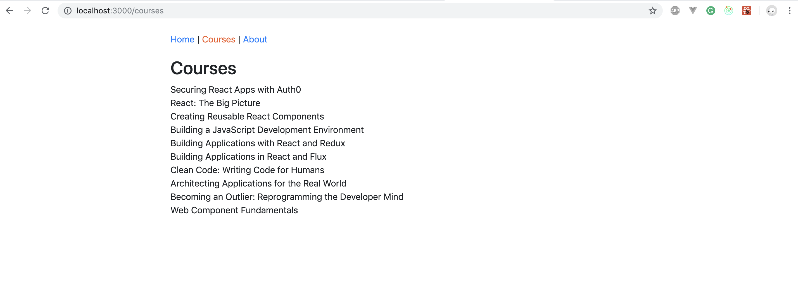

Let's fetch the courses from api and enhance Courses Page.
Make asynchronous call to api using [redux-thunk](https://github.com/reduxjs/redux-thunk#installation)


## Courses Page


### Setup
1. Copy the backend folder into your app root folder.
2. Install `json-server` to run the mock api server.
3. Put the following in the scripts in package.json
   ```
    "start": "run-p start:dev start:api",
    "start:dev": "webpack-dev-server --config webpack.config.dev.js --port 3000",
    "prestart:api": "node tools/createMockDb.js",
    "start:api": "node tools/apiServer.js
    ```
4. Copy api folder into src folder.

### Requirements
1. Use redux-thunk to call api and store the data in redux
2. Show the list of courses in the courses page